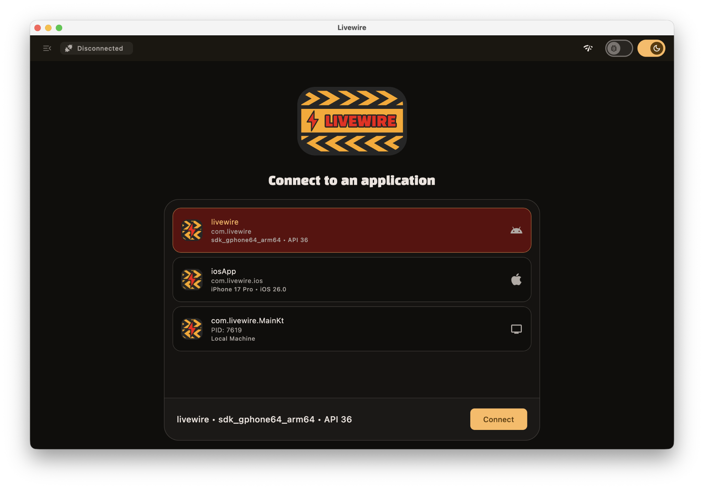
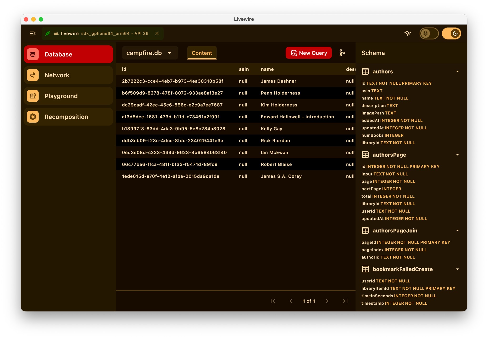
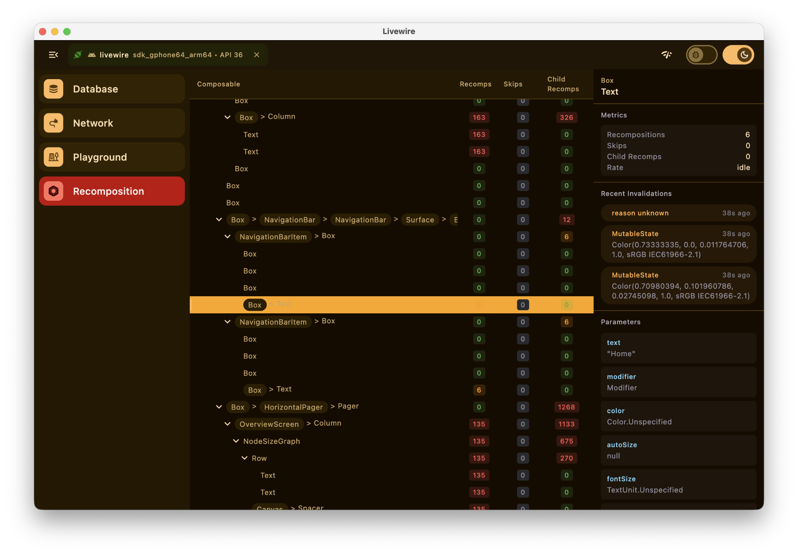
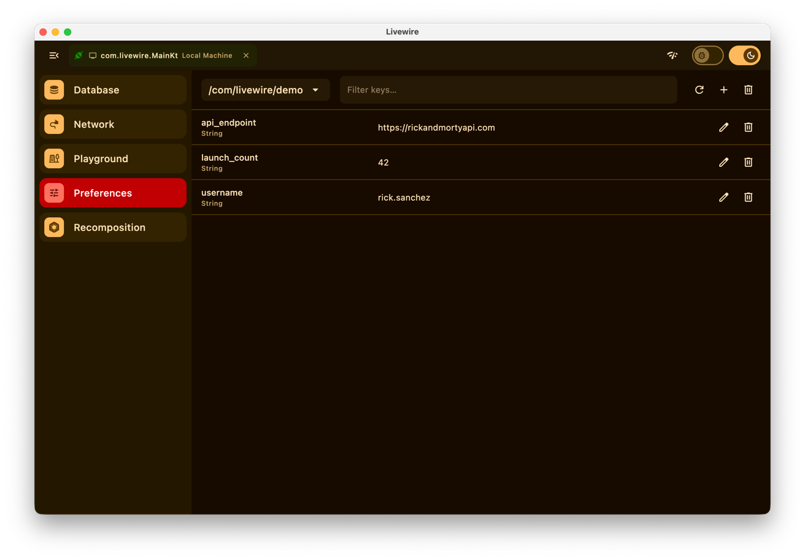

<p align="center">
  
</p>

<p align="center">
  A app-driven remote compose framework for driving a side-car / companion desktop app for debugging your Android application.
</p>

<p align="center">
  
</p>

---

Livewire embeds a small client in your app that serves remote compose driven debugging tools such as database browsing, network inspection, and more, as a stream of UI over the wire. The desktop host app discovers running clients on connected devices, connects, and renders that UI live.

- **Client**: a library you add to your app. It broadcasts itself for discovery and streams plugin UI to the host.
- **Host**: a desktop app you run on your machine. It finds clients over ADB (Android), USB (iOS), or localhost (Desktop), and renders whatever they serve.

## Quick Start

> 🚧 Livewire is a work in progress — published artifacts and host app downloads are not available yet.

### 1. Add the client to your app

```kotlin
// build.gradle.kts
dependencies {
  // Core SDK for integrating into your app
  implementation("com.livewire-kt.livewire:client:<version>")

  // SQLite Database Viewer
  implementation("com.livewire-kt.livewire:plugin-database:<version>")

  // Network Viewer
  implementation("com.livewire-kt.livewire:plugin-network-core:<version>")
  implementation("com.livewire-kt.livewire:plugin-network-ktor:<version>")
  implementation("com.livewire-kt.livewire:plugin-network-okhttp:<version>")

  // Preferences Viewer (SharedPreferences, DataStore, NSUserDefaults)
  implementation("com.livewire-kt.livewire:plugin-preferences:<version>")

  // Jetpack Compose Recomposition Viewer
  implementation("com.livewire-kt.livewire:plugin-recomposition:<version>")
}
```

Create a client, install the plugins you want, and start it:

```kotlin
val livewireClient = LivewireClient {
  install(DatabasePlugin(context))
  install(NetworkPlugin())
  install(PreferencesPlugin(context))
}

livewireClient.start()
```

### 2. Run the host

macOS:

```bash
brew install --cask livewire-kt/tap/livewire
```

or

```bash
brew tap livewire-kt/tap
brew install --cask livewire
```

Until publishing is configured for other platforms, you may run the host app from source:

```bash
./gradlew :host:run
```

Native installers can also be built with Compose Desktop packaging:

```bash
./gradlew :host:packageDistributionForCurrentOS # .dmg / .msi / .deb
```

With your app running on a connected device, emulator, or the same machine, the host discovers it automatically, just select it to connect.

## First-Party Plugins

### SQLite
```kotlin
// build.gradle.kts
dependencies {
  implementation("com.livewire-kt.livewire:plugin-database:<version>")
}
```
<p align="center">
  
</p>

### Network Viewer
```kotlin
// build.gradle.kts
dependencies {
  implementation("com.livewire-kt.livewire:plugin-network-core:<version>")

  // Plus…
  implementation("com.livewire-kt.livewire:plugin-network-ktor:<version>")
  // or…
  implementation("com.livewire-kt.livewire:plugin-network-okhttp:<version>")
}
```
<p align="center">
  
</p>

### Preferences (SharedPreferences, DataStore, NSUserDefaults)
```kotlin
// build.gradle.kts
dependencies {
  implementation("com.livewire-kt.livewire:plugin-preferences:<version>")
}
```
<p align="center">
  
</p>

### Recomposition Viewer
```kotlin
// build.gradle.kts
dependencies {
  implementation("com.livewire-kt.livewire:plugin-recomposition:<version>")
}
```
<p align="center">
  
</p>

## Building a New Plugin
Making it easy to build custom plugins was the driving factor for developing Livewire. Read about how to build your own [in the docs](https://livewire-kt.github.io/livewire/plugins/building/).

## License

```
Copyright 2026 livewire-kt

Licensed under the Apache License, Version 2.0 (the "License");
you may not use this file except in compliance with the License.
You may obtain a copy of the License at

    http://www.apache.org/licenses/LICENSE-2.0

Unless required by applicable law or agreed to in writing, software
distributed under the License is distributed on an "AS IS" BASIS,
WITHOUT WARRANTIES OR CONDITIONS OF ANY KIND, either express or implied.
See the License for the specific language governing permissions and
limitations under the License.
```
