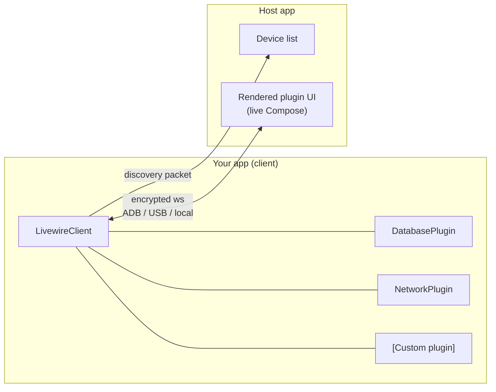

# About

  

**Livewire** is a real-time development bridge for Kotlin Multiplatform apps powered by a custom Compose composition. It embeds a small client in your Android, iOS, or Desktop app that serves built-in and custom debugging tools — database browsing, network inspection, and more — as a stream of UI over an encrypted socket. A desktop **host** app discovers running clients on connected devices, connects, and renders that tooling UI remotely.

## Why Livewire?

Debuggers just show you your app's _memory_ and not it's _meaning_. Out of the box tools like logcat, layout inspector, network profilers and so on lack your app's domain knowledge. Other side-car debugging tools have brittle communication layers and require multiple codebases just to extend meaning to them. Livewire takes a different approach:

- **Single source of truth.** Livewire is driven entirely from within your own application. No communication protocol to get out of sync. No separate plugin codebases to be updated.
- **Compose over the wire.** Plugin and debugging UI is written in the same framework that powers your applications UI.
- **Built to be extended.** Adding new plugins can be done next to the code that you want to debug. Shipped in your codebase so your fellow developers have immediate access without extra setup and installation.
- **Multiplatform by design.** Built to work with all KMP applications and targets.

## How it works

1. Your app creates a `LivewireClient`, installs plugins, and starts it. The client broadcasts a discovery packet announcing itself.
2. The host scans for clients over **ADB** (Android devices), **USB** (iOS devices), and **localhost** (desktop apps on the same machine).
3. When you connect, the two sides perform an encrypted handshake, then plugin UI streams to the host and your interactions stream back.

## Project status

!!! warning "Work in progress"
    Livewire is under active development. Published artifacts and host app downloads are not available yet — for now, everything runs from source. APIs may change without notice.

## License

Livewire is released under the [Apache License, Version 2.0](https://www.apache.org/licenses/LICENSE-2.0).
